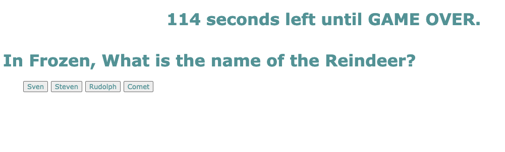

# Code-Quiz-4

## Description

In this project we were required to make a quiz with a timer. If a question was answered incorrectly time would be deducted from the clock. If the timer reached 0 it would be game-over. After the game is completed you are required to record your initials and score and store them. My motivation for this project was primarily to learn more about Javascript. Key concepts would be event.listeners,getElementbyid, producing a timer, and storing and saving scores. In this project I learned how to run my javascript dynamically through HTML in order to produce a quiz. Then by using CSS I can style my Quiz to my liking.

## User Story

```
AS A coding boot camp student
I WANT to take a timed quiz on JavaScript fundamentals that stores high scores
SO THAT I can gauge my progress compared to my peers
```

## Screenshot of Quiz



## Links

* https://github.com/carsonccu/Code-Quiz-DU
* 
